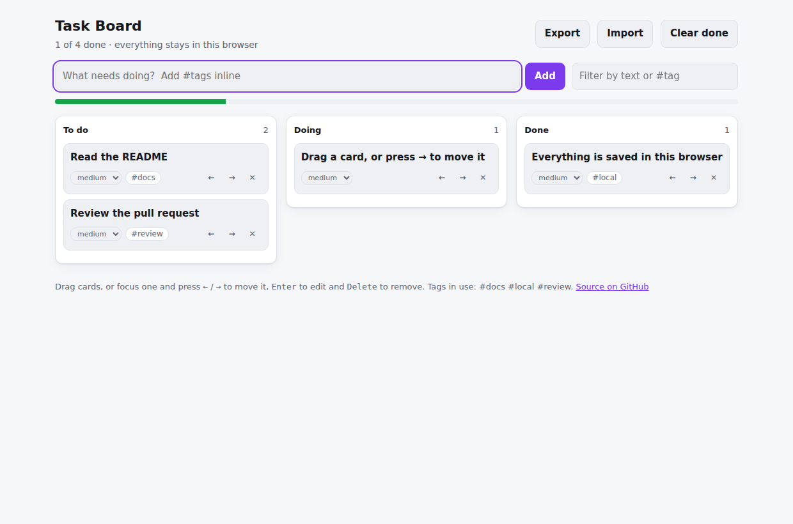

# Task Board

[](https://github.com/umer-78/task-board/actions/workflows/ci.yml)


**Live:** https://umer-78.github.io/task-board/

A kanban board in React and TypeScript that works with a **keyboard as well as a
mouse**, stores everything in your browser, and never asks you to sign in.



## Features

- Three columns, drag and drop, and **arrow keys** to move a focused card —
  dragging alone locks out anyone who cannot use a mouse
- Inline `#tags` typed straight into the title: *"Fix login #auth"*
- Filter by text or by tag as you type
- Inline editing (`Enter` to edit, `Escape` to cancel, `Delete` to remove)
- Priority per card, progress bar, "clear done"
- Cards glide to their new column, fade in when added and out when deleted,
  built with [Motion](https://motion.dev). Focus follows a card moved with the
  arrow keys, and people who ask their system for reduced motion get a plain fade
- **Export and import** as JSON, so your board is portable
- Tells you plainly when the browser refuses to save (private mode, full quota)
  instead of losing work silently
- Light and dark theme, works on a phone

## Keyboard

| Key | Action |
|---|---|
| `Tab` | move between cards |
| `←` `→` | move the focused card between columns |
| `Enter` | edit the focused card |
| `Escape` | cancel editing |
| `Delete` / `Backspace` | delete the focused card |

## How it is put together

```
src/lib/types.ts     the shape of a board
src/lib/board.ts     every rule as a pure function: create, update, move, filter, stats
src/lib/storage.ts   load/save/export/import, with every access guarded
src/components/      Column and TaskCard
src/App.tsx          state, handlers, layout and the card animations
```

State lives in one object and every change goes through a **pure function**
(`createTask`, `moveTask`, `nudge`, …), which is why the rules can be tested
without rendering, and why the component code stays short.

Two details worth pointing at:

- `completedAt` is derived from the column, never set by hand, so moving a card
  out of *Done* clears it and a report cannot read a stale completion date.
- `storage.ts` validates every task it loads. A corrupted or hand-edited
  `localStorage` value gives you an empty board, not a white screen.

## Develop

Requires **Node.js 22 LTS**.

```bash
git clone https://github.com/umer-78/task-board.git
cd task-board
nvm use
npm ci
npm run dev        # http://localhost:5173
npm test           # 21 tests (vitest + Testing Library)
npm run typecheck
npm run build      # static site in dist/
```

`npm test` covers the board rules (ordering, moving, completion dates, filtering
by tag, stats) and the app in a jsdom browser: adding a task with an inline tag,
moving one with the keyboard, filtering, inline editing and clearing the done
column.

## Deployment

Pushing to `main` runs the tests and publishes `dist/` to GitHub Pages
(`.github/workflows/deploy.yml`). `vite.config.ts` sets the `/task-board/` base
path for the build only, so local development still serves from `/`.

## License

[MIT](LICENSE)
